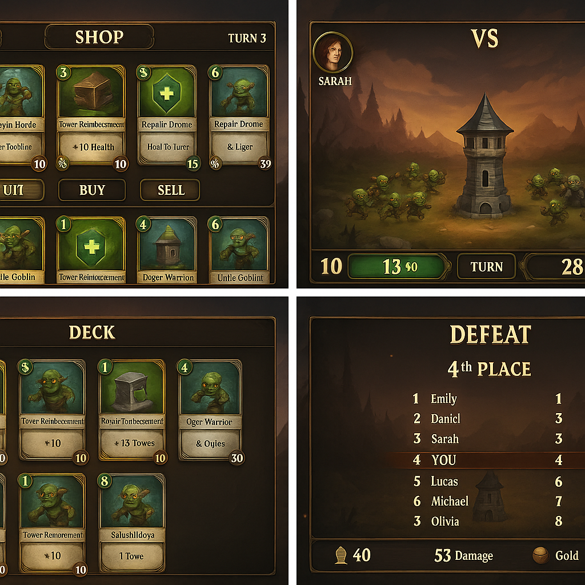
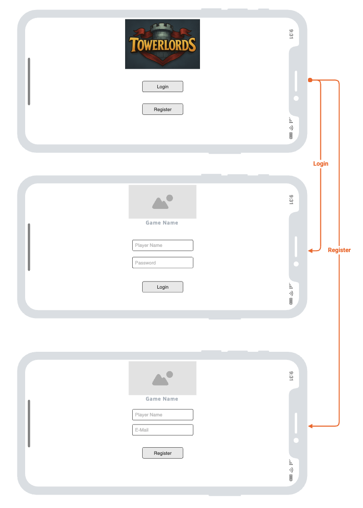
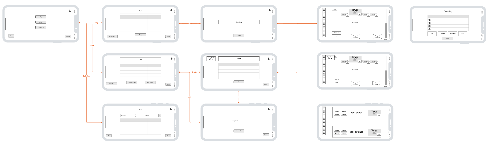
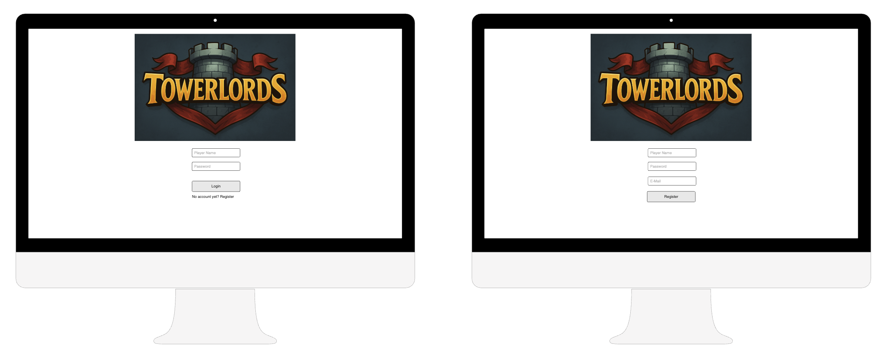
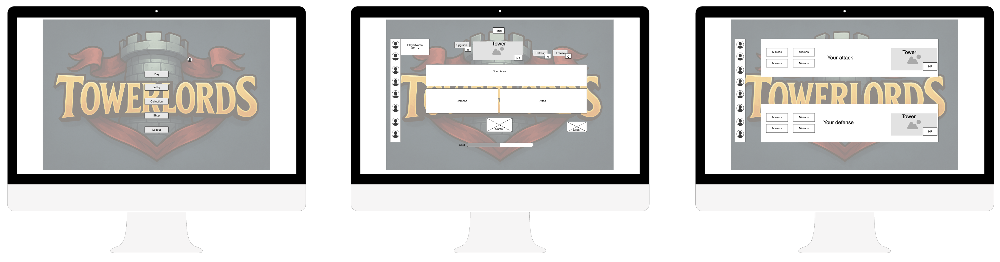
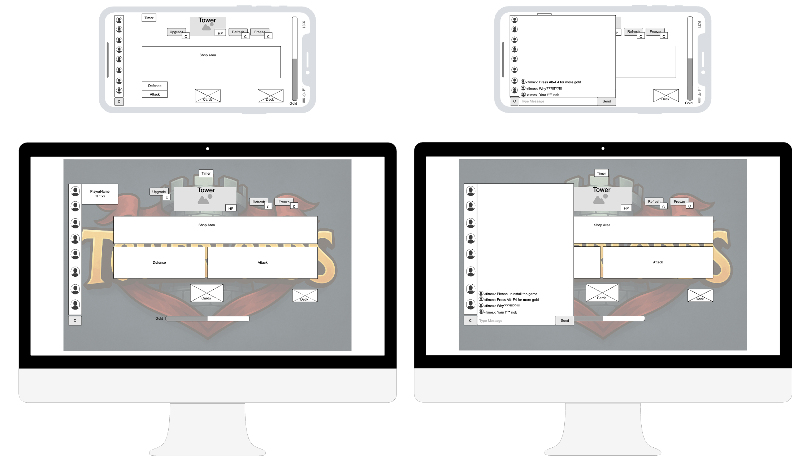
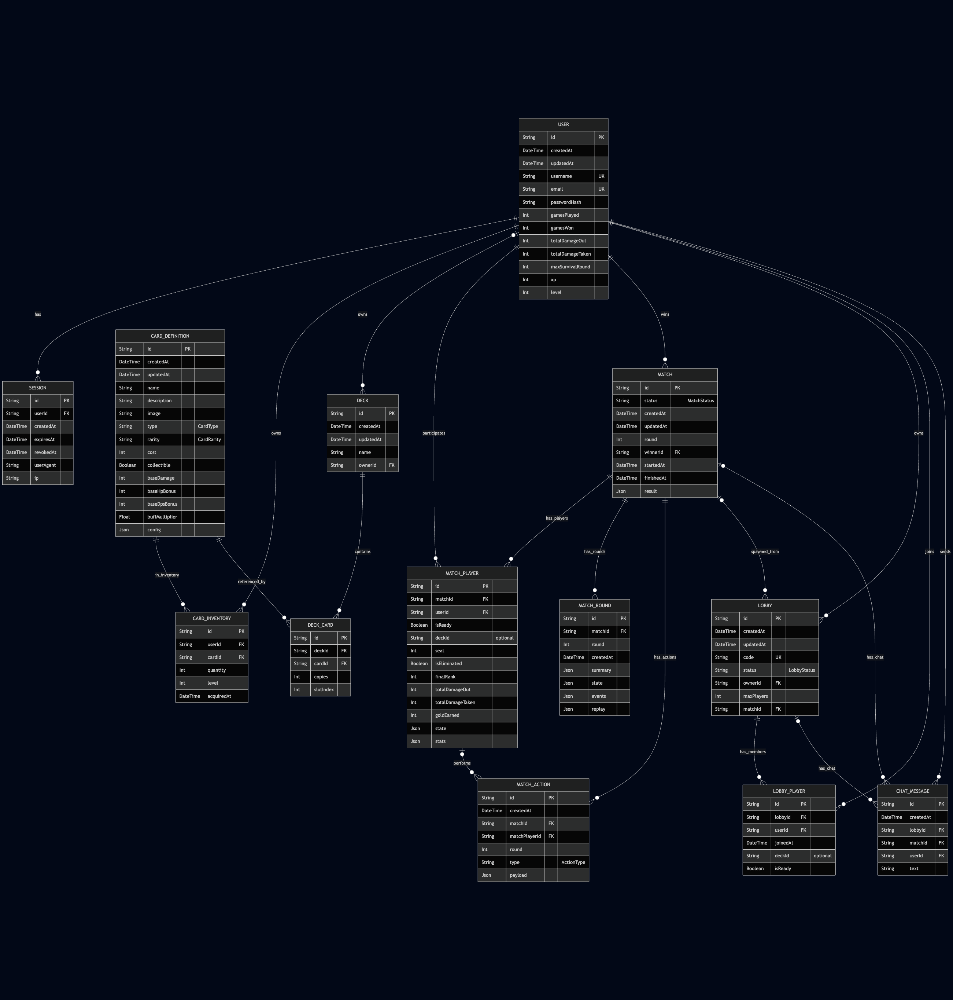
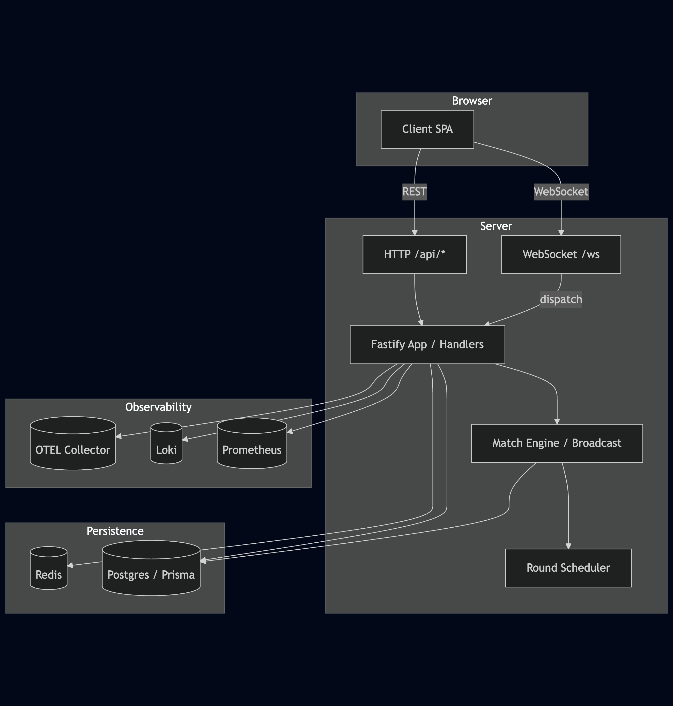
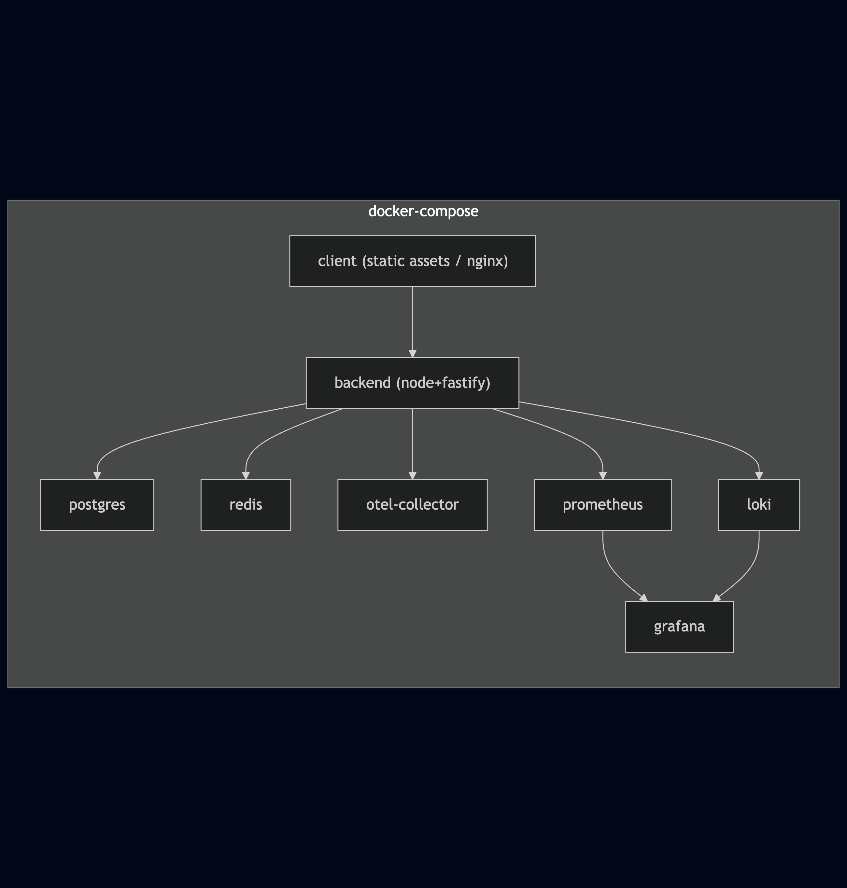
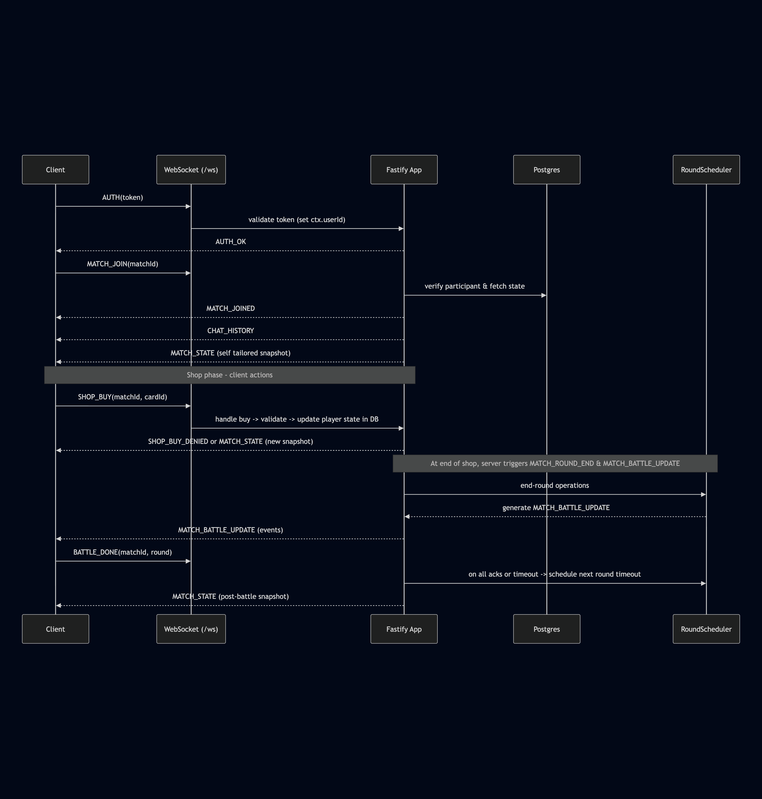

# Projektdokumentation TowerLords

[[_TOC_]]

## Spielidee
TowerLords ist ein Deckbuilding Tower-Defense Auto-Battler. Nachfolgend wird die Idee und Logik des Spiel erläutert.

### Ziel des Spiels
Acht Spieler treten gegeneinander an, jeder besitzt einen eigenen Turm.  
Ziel: als letzter Spieler mit intaktem Turm überleben.  
Spieler bauen sich im Laufe der Partie ein individuelles Deck auf, um:
- **Angriffswellen** gegen Gegner zu senden
- **ihren Turm** zu verstärken
- **wirtschaftliche Vorteile** zu erzielen

### Grundprinzip
Die Partie verläuft rundenbasiert.
Jede Runde hat zwei Phasen:

1. **Einkaufs- und Deckbuilding-Phase** (ca. 30–60 Sek.)  
   - Spieler ziehen Handkarten aus ihrem persönlichen Deck.  
   - Shop bietet zufällige neue Karten zur Auswahl.  
   - Spieler kaufen, verkaufen, upgraden oder entfernen Karten.  
   - Gespielte Karten wirken sofort auf Turmzustand oder vorbereiten Angriffs-Wellen.  
   - Ungenutzte Karten wandern zurück in den Nachziehstapel.

2. **Kampf- und Simulationsphase**  
   - Spieler werden zufällig gepaart.  
   - Angriffskarten werden in Gegnerwellen umgewandelt.  
   - Verteidigungskarten modifizieren Turm-HP, Schaden oder Spezialeffekte.  
   - Server simuliert den Kampf:
       - Turm feuert in Ticks auf Gegnerwelle.
       - Überlebende Gegner fügen Turm Schaden zu.
   - Ergebnis wird an alle Clients zurückgespielt.

### Kartentypen
- **Angriffskarten**  
  - Spawnen Gegnerwellen (z. B. Goblins, Oger).  
  - Schaden skalierbar über Kartenstärke und Upgrades.
- **Verteidigungskarten**  
  - Erhöhen Turm-HP, Turm-DPS oder fügen Spezialeffekte hinzu  
    (Splash Damage, Slow, Gift).
- **Buffkarten**  
  - Verstärken nächste Angriffs- oder Verteidigungsaktion (z. B. +20 % DPS).
- **Wirtschaftskarten**  
  - Generieren Gold oder erlauben mehr Karten-Draw in der nächsten Runde.

### Deckbuilding-Mechanik
- Startdeck enthält einzelne Basis Angriffe und Verteidigungs Karten.  
- Pro Runde zieht der Spieler eine feste Anzahl Karten (z. B. 5).  
- Kartenpool (Deck) wird durch Shopkäufe erweitert.  
- Gleiche Karten können kombiniert werden → Stärkere Variante.  
- Entfernen von Karten möglich, um Deck zu optimieren.

### Turm-Mechanik
- Jeder Turm hat **HP**, **DPS**, **Tickrate** und optionale weitere Modifikatoren.  
- Verteidigungskarten wirken auf diese Werte temporär oder permanent.  
- Turm kann gelevelt werden (höhere Basis-DPS, mehr HP, schaltet höher Stufige Karten frei).

### Sieg- und Niederlagebedingungen
- Fällt der Turm (HP ≤ 0), verliert der Spieler.
- Letzter überlebender Spieler gewinnt.  
- Highscore kann aus Überlebenszeit, verursachtem Gesamtschaden und gesammeltem Gold berechnet werden.

### Balancing-Ansätze
- Rundenzeit strikt begrenzt, um Spielfluss hoch zu halten.  
- Gegnerwellen skalieren pro Runde, um Spielende zu erzwingen.  
- Gold-Einkommen pro Runde fix, zusätzliche Wirtschaftskarten erhöhen dieses nur leicht.  
- Simulation deterministisch → identische Eingaben führen immer zu identischen Ergebnissen.

### Technische Anforderungen
- **Server:** Source-of-Truth, speichert Decks, Turmzustände, Lebenspunkte.  
- **Client:** Stellt Shop, Deck, Turm-HP, Wellen-Resultate in Echtzeit dar.  
- **Kommunikation:**  
  - Einkaufsentscheidungen → sofort an Server  
  - Kampfphase → nur Ergebnis der Simulation an Client  
  - Transport: WebSocket für Realtime-Sync  

### Erweiterungspotential
- Einführung von Turmplatzierung (mehrere Türme statt einem)  
- Mehr Kartentypen (Zauber, globale Events)  
- Turniere oder Ranglisten  
- Kartenvarianz, Packs
- Indiviualisierung durch Skins

## Funktionsumfang

### Muss-Kriterien (Pflicht)
- **Mehrspieler-Funktion:** mind. 2 Spieler pro Match, simultane Teilnahme (max. 8).
- **Deckbuilding:** 
  - Startdeck, Shop, Kauf/Verkauf, Kartenkombination.  
  - Handkarten-Management pro Runde.  
- **Tower-Defense-Mechanik:** 
  - Turm mit HP/DPS/Tickrate. 
  - Verteidigungskarten wirken temporär oder permanent.  
  - Server simuliert Angriffs- und Verteidigungsphase deterministisch.  
- **Kampfsimulation:** 
  - Gegnerwellen werden basierend auf Angriffskarten generiert.  
  - Überlebende Gegner fügen dem Turm Schaden zu.  
- **Echtzeit-Synchronisation:** 
  - Client-Server-Kommunikation über WebSocket.  
  - Alle Spieler sehen zeitgleich ihre Resultate.  
- **Persistenz:** 
  - Speicherung von Deck, Turmzustand, Lebenspunkten, Rundenverlauf.  
  - Damit ist eine Nachvollziehbarkeit von Spielzügen auch nach Spielende gewährleistet.  
- **Chat-Funktion:** 
  - Echtzeit-Chat für alle Spieler pro Match.  

### Kann-Kriterien (Optional)
- **Highscore- oder Ranglisten-System:** globale Spielerstatistik.  
- **Replay-System:** Anzeige vergangener Kämpfe.  
- **Erweiterte Wirtschaft:** zusätzliche Ressourcen, komplexere Gold-Strategien.  
- **Visuelle Effekte:** Animationen für Turmfeuer, Gegnerwellen.  
- **Progression:** Metagame mit freischaltbaren Karten und Packs.  

### Abgrenzung (Nicht enthalten)
- **Keine freie Turmplatzierung:** nur ein zentraler Turm pro Spieler.  
- **Kein komplexes Mana-System:** Ressourcenmanagement reduziert auf Gold und Level.  
- **Keine persistenten Einheiten auf dem Spielfeld:** alle Karten wirken rundenweise.  
- **Keine KI-Gegner:** Fokus liegt ausschliesslich auf PvP.  
- **Keine Monetarisierung:** keine Echtgeldkäufe oder Microtransactions.  
- **Kein Turniermodus:** nur Einzelmatches.  

### Benutzeroberflächen
- **Lobby-Screen:** Matchmaking und Spieleranzeige.  
- **Shop- & Deck-Screen:** Anzeige von Handkarten, Kaufoptionen, Goldstand.  
- **Kampf-Screen:** Darstellung Turm, Gegnerwellen, HP- und Schadensverlauf.  
- **Ergebnis-Screen:** Übersicht Schaden, verbleibendes Leben, Rang.  
- **Chat-Fenster:** aufklappbar.

## Technologie Stack
### Frontend
- TypeScript
- Tailwind CSS
- Native WebSocket API + reconnecting-websocket für Auto-Reconnect.
- State-Pattern: kleines EventEmitter, optional immer für immutable Updates.
- UI-Bausteine: Web Components (ohne Framework) für Shop, Hand, Kampf, Chat.

### Backend
- Node.js
- Fasity
- PortgresSQL (Transaktionen, State)
- Redis für Matchmakin, Pub/Sub, Locks
- Auth: JWT
- Validation: Zod (Typescript Schema Validation)
- Logging: Loki, Prometheus, Grafana

### Realtime & Protokoll
- Transport: WebSocket, evtl. AJAX/Fetch für Lobby/Assets
- Format: JSON

### Tests
- ESLint

### Deployment
- Docker + docker-compose
- evtl. Kubernetes

## Anforderungen

### Funktionale Anforderungen – MUSS

#### FA-001 – Match erstellen
**Name:** Match-Lobby erstellen  
**ID:** FA-001  
**Ziel:** Spieler können ein 2-Spieler-Match hosten/joinen.  
**Ereignis:** Spieler klickt „Lobby erstellen“ oder „Beitreten“.  
**Vorbedingung:** Account eingeloggt, Server erreichbar.  
**Standardablauf:**
Client sendet `CREATE_LOBBY` oder `JOIN_LOBBY`.
Server legt Lobby an bzw. fügt Spieler hinzu.
Server broadcastet Lobby-Status.  
**Alternativablauf:** Lobby voll → Meldung „Lobby voll“. Netzwerkfehler → Retry/Fehler.  
**Nachbedingung Erfolg:** Spieler ist in Lobby, sieht Teilnehmerliste.  
**Nachbedingung Fehler:** Keine Lobbyzuordnung.  
**Klassifizierung:** Funktional, MUSS  
**Aufwand:** MITTEL

#### FA-002 – Karten kaufen
**Name:** Shop-Kauf  
**ID:** FA-002  
**Ziel:** Spieler kauft Karten in der Kaufphase.  
**Ereignis:** Klick „Kaufen“.  
**Vorbedingung:** Kaufphase aktiv, ausreichend Gold, Kartenlimit nicht überschritten.  
**Standardablauf:** `BUY_CARD` → Gold −= Kosten → Karte ins Deck.  
**Alternativablauf:** Zu wenig Gold → Fehlermeldung.  
**Nachbedingung Erfolg:** Karte im Deck persistiert.  
**Nachbedingung Fehler:** Keine Änderung.  
**Klassifizierung:** Funktional, MUSS  
**Aufwand:** MITTEL

#### FA-003 – Karten ausspielen
**Name:** Ausspielphase  
**ID:** FA-003  
**Ziel:** Handkarten aktivieren einen Effekt in der Runde.  
**Ereignis:** Spieler bestätigt „Fertig“.  
**Vorbedingung:** Ausspielphase aktiv, Handkarten vorhanden.  
**Standardablauf:** Client sendet `PLAY_CARDS` mit Hand-IDs → Server validiert → markiert Effekte (Angriffswellen, Turmbuffs).  
**Alternativablauf:** Ungültige IDs → Reject, Hand bleibt.  
**Nachbedingung Erfolg:** Effekt in der Kampfsimulation.  
**Nachbedingung Fehler:** Keine Effekte.  
**Klassifizierung:** Funktional, MUSS  
**Aufwand:** MITTEL

#### FA-004 – Registrieren
**Name:** Spieler registrieren  
**ID:** FA-004  
**Ziel:** Spieler hat sich registriert.  
**Ereignis:** Spieler klickt auf registrieren.  
**Vorbedingung:** Einzigartiger und gültiger Spielernamen, sowie Email und ein Passwort sind gesetzt.  
**Standardablauf:** Client sendet `REGISTER_PLAYERNAME` → Server validiert → markiert gültigen Spielernamen → Client sendet Email und Passwort → Server validiert und speichert.  
**Alternativablauf:** Ungültige Eingaben → Fehlermeldung.  
**Nachbedingung Erfolg:** Spielerregistrierung abgeschlossen.  
**Nachbedingung Fehler:** Keine Registrierung erfolgt.  
**Klassifizierung:** Funktional, MUSS  
**Aufwand:** MITTEL

#### FA-005 – Kampfsimulation
**Name:** Tower-vs-Wave Simulation  
**ID:** FA-005  
**Ziel:** Server simuliert Tick-basiert Turm gegen Gegnerwelle.  
**Ereignis:** Rundenabschluss.  
**Vorbedingung:** Alle `PLAY_CARDS` eingegangen oder Timer abgelaufen.  
**Standardablauf:** Deterministische Simulation → DamageIn/Out, Leben anpassen.  
**Alternativablauf:** Spieler spielt keine Aktion (AFK) → leere Aktion.  
**Nachbedingung Erfolg:** `ROUND_RESULT` an Clients, Log gespeichert.  
**Nachbedingung Fehler:** Runde wird wiederholt oder als „No-Action“ gewertet.  
**Klassifizierung:** Funktional, MUSS  
**Aufwand:** HOCH

#### FA-006 – Chat
**Name:** Match-Chat  
**ID:** FA-006  
**Ziel:** Realtime-Chat im Match.  
**Ereignis:** Nachricht senden.  
**Vorbedingung:** Verbunden per WebSocket, im Match.  
**Standardablauf:** `CHAT_SEND` → Broadcast → Anzeige.  
**Alternativablauf:** Rate-Limit überschritten → Block.  
**Nachbedingung Erfolg:** Nachricht geloggt.  
**Nachbedingung Fehler:** Keine Zustellung.  
**Klassifizierung:** Funktional, MUSS  
**Aufwand:** NIEDRIG

#### FA-007 – Runden-Timer
**Name:** Phasen-Steuerung  
**ID:** FA-007  
**Ziel:** Server steuert Kauf- und Kampfphasen.  
**Ereignis:** Phasenwechsel.  
**Vorbedingung:** Match aktiv.  
**Standardablauf:** Timer startet Kaufphase → Countdown → Wechsel zu Kampf → Ergebnis → nächste Runde.  
**Alternativablauf:** Time Drift → Server setzt authoritative Zeit, ein Resync findet statt.  
**Nachbedingung Erfolg:** Synchrone Phasen bei allen.  
**Nachbedingung Fehler:** Fallback auf Serverzeit, Resync.  
**Klassifizierung:** Funktional, MUSS  
**Aufwand:** NIEDRIG

#### FA-008 – Persistenz & Replay
**Name:** Aktionen-Log  
**ID:** FA-008  
**Ziel:** Spielzüge nachvollziehbar nach Spielende.  
**Ereignis:** Jede Aktion.  
**Vorbedingung:** DB verfügbar.  
**Standardablauf:** Append-only Log `actions` + Runden-Snapshots.  
**Alternativablauf:** DB-Fehler → Spielzug wird nicht aufezeichnet.  
**Nachbedingung Erfolg:** Replay rekonstruierbar.  
**Nachbedingung Fehler:** Runde markiert als "nicht aufgezeichnet".  
**Klassifizierung:** Funktional, MUSS  
**Aufwand:** MITTEL

### Funktionale Anforderungen – KANN

#### FA-101 – Karten Packs
**Name:** Karten-Packs  
**ID:** FA-101  
**Ziel:** Karten ausserhalb des Matches freischalten.  
**Klassifizierung:** Funktional, KANN  
**Aufwand:** MITTEL

#### FA-102 – Highscore
**Name:** Rangliste  
**ID:** FA-102  
**Ziel:** Saisonale Leaderboards.  
**Klassifizierung:** Funktional, KANN  
**Aufwand:** NIEDRIG

#### FA-103 – Replay-Viewer
**Name:** Wiederholung abspielen  
**ID:** FA-103  
**Ziel:** Runden timelinebasiert ansehen.  
**Klassifizierung:** Funktional, KANN  
**Aufwand:** MITTEL

#### FA-104 – Private Lobbys
**Name:** Passwort-Lobby  
**ID:** FA-104  
**Klassifizierung:** Funktional, KANN  
**Aufwand:** NIEDRIG

#### FA-105 – Karten kombinieren
**Name:** Triple/Kombination  
**ID:** FA-105  
**Ziel:** 3 gleiche Karten werden zu 1 kombiniert (verbesserte Version).  
**Ereignis:** Dritte Kopie wird erworben.  
**Vorbedingung:** Zwei Kopien vorhanden.  
**Standardablauf:** Server entfernt 3 Kopien → fügt Verbesserte-Karte hinzu → optional Bonus.  
**Alternativablauf:** Nicht identische Karten → keine Aktion.  
**Nachbedingung Erfolg:** Upgrade im Deck, Logeintrag.  
**Nachbedingung Fehler:** Zustand unverändert.  
**Klassifizierung:** Funktional, KANN  
**Aufwand:** NIEDRIG

#### FA-106 – Erhöhung der Spieleranzahl
**Name:** Spieleranzahl auf 8 Spieler erhöhen
**ID:** FA-106  
**Klassifizierung:** Funktional, KANN  
**Aufwand:** MITTEL

#### FA-107 – Erweiterung der "Wirtschaft"
**Name:** Zusätzliche Ressourcen wie Mana oder komplexere Gold Strategien
**ID:** FA-107  
**Klassifizierung:** Funktional, KANN  
**Aufwand:** HOCH

#### FA-108 – Visuelle Effekte
**Name:** Animationen für Gegnerwellen und Türme
**ID:** FA-108
**Klassifizierung:** Funktional, KANN  
**Aufwand:** HOCH

### Nicht-funktionale Anforderungen – MUSS

#### NFA-001 – Latenz
**Name:** WebSocket-Latenz  
**ID:** NFA-001  
**Ziel:** Roundtrip ≤ 400 ms.
**Klassifizierung:** Nicht-funktional, MUSS  
**Aufwand:** NIEDRIG

#### NFA-002 – Verfügbare Karten
**Name:** Basiskarten stehen zur Verfügung
**ID:** NFA-002  
**Ziel:** In jeder Kategorie stehen Basis Karten zur Verfügung.
**Klassifizierung:** Nicht-funktional, MUSS  
**Aufwand:** MITTEL

#### NFA-003 – Sicherheit
**Name:** Authentifizierung/Validation
**ID:** NFA-003  
**Ziel:** JWT, Rate-Limits, Input-Validation.  
**Klassifizierung:** Nicht-funktional, MUSS  
**Aufwand:** MITTEL

#### NFA-004 – Verfügbarkeit
**Name:** Stabilität  
**ID:** NFA-004  
**Ziel:** Match darf bei Client-Disconnect nicht abbrechen.  
**Klassifizierung:** Nicht-funktional, MUSS  
**Aufwand:** NIEDRIG

### Nicht-funktionale Anforderungen – KANN

#### NFA-101 – Anti-Cheat
**Name:** Anomalie-Erkennung  
**ID:** NFA-101  
**Ziel:** Signaturen, überprüfung von Manipulationsversuchen.  
**Klassifizierung:** Nicht-funktional, KANN  
**Aufwand:** HOCH

#### NFA-102 – Logging/Monitoring
**Name:** Observability  
**ID:** NFA-102  
**Ziel:** Prometheus-Metriken, Loki-Logs, Dashboards.  
**Klassifizierung:** Nicht-funktional, KANN  
**Aufwand:** MITTEL

#### NFA-103 – Erweiterte Karten
**Name:** Zusatzkarten  
**ID:** NFA-102  
**Ziel:** Weitere Karten die über das Basisset hinausgehen stehen zur Verfügung.  
**Klassifizierung:** Nicht-funktional, KANN  
**Aufwand:** MITTEL

### Abgrenzungen

#### AB-001 - KI
**Name:** KI Gegner  
**ID:** AB-001
**Ziel:** Es stehen KI Gegner zur Verfügung.
**Klassifizierung:** Abgrenzung

#### AB-002 - Turmplatzierung / mehrere Türme
**Name:** Mehrere Türme und Platzierung
**ID:** AB-001
**Ziel:** Türme können strategisch platziert werden.
**Klassifizierung:** Abgrenzung

## Planungen

### Visual

TowerLords Logo (mit AI generiert).

Möglicher visueller Look des Spiels (mit AI generiert).

### Wireframes

#### Mockups

Mobile Mockup von Towerlords.

Desktop Mockup wie sich die Oberfläche ändert im Vergleich zu Mobile.

Mockup des Chats.

### Protokoll
#### Client-Server-Interaktionen – TowerLords
Die Implementation im Repo verwendet einen WebSocket-Endpunkt (`/ws`) für Echtzeit-Interaktionen und REST-HTTP-Endpunkte unter `/api` für Konto-, Lobby- und Match-bezogene Operationen. Nachfolgend eine kompakte Tabellen-Referenz; für komplette Typdefinitionen siehe `server/src/ws/protocol.ts` und `shared/protocol/types/match.ts`.

##### Verbindung & Auth / Keepalive
| Richtung        |           Nachricht | Beispiel-Payload                                       | Hinweise                                    |
|-----------------|--------------------:|--------------------------------------------------------|---------------------------------------------|
| Server → Client |               HELLO | { type: "HELLO", connId, room: "lobby", ts }           | Gesendet unmittelbar nach Verbindungsaufbau |
| Client → Server |                AUTH | { type: "AUTH", token }                                | Authentifiziert Verbindung (JWT)            |
| Server → Client | AUTH_OK / AUTH_FAIL | { type: "AUTH_OK", userId } oder { type: "AUTH_FAIL" } | Bei Erfolg liefert AUTH_OK userId           |
| Client → Server |                PING | { type: "PING" }                                       | Keepalive / Latenzprobe                     |
| Server → Client |                PONG | { type: "PONG" }                                       | Antwort auf PING                            |

##### WebSocket: Client → Server (wichtige Nachrichten)
| Nachricht            |                                       Minimaler Payload | Zweck / Hinweis                                                                                   |
|----------------------|--------------------------------------------------------:|---------------------------------------------------------------------------------------------------|
| MATCH_JOIN           |                         { type: "MATCH_JOIN", matchId } | Betritt match-spezifischen Raum; server sendet MATCH_JOINED, CHAT_HISTORY, MATCH_STATE (per-user) |
| MATCH_STATE_REQUEST  |                { type: "MATCH_STATE_REQUEST", matchId } | Fordert eine direkte MATCH_STATE-Antwort an                                                       |
| MATCHMAKING_START    |                  { type: "MATCHMAKING_START", deckId? } | Start Suche (optional Deck)                                                                       |
| MATCHMAKING_CANCEL   |                          { type: "MATCHMAKING_CANCEL" } | Abbruch der Suche                                                                                 |
| MATCH_READY_CONFIRM  |                { type: "MATCH_READY_CONFIRM", matchId } | Bestätigung Ready-Status                                                                          |
| LOBBY_SUBSCRIBE      |                    { type: "LOBBY_SUBSCRIBE", lobbyId } | Subscribes Lobby Raum                                                                             |
| LOBBY_SET_DECK       |             { type: "LOBBY_SET_DECK", lobbyId, deckId } | Wählt Deck in Lobby                                                                               |
| LOBBY_SET_READY      |           { type: "LOBBY_SET_READY", lobbyId, isReady } | Setzt Ready-Flag in Lobby                                                                         |
| CHAT_SEND            |                    { type: "CHAT_SEND", matchId, text } | Sendet Chat-Nachricht (persistiert + broadcast)                                                   |
| CHAT_HISTORY_REQUEST |               { type: "CHAT_HISTORY_REQUEST", matchId } | Fordert Chat-History an                                                                           |
| SHOP_REROLL          |                        { type: "SHOP_REROLL", matchId } | Shop: neue Angebote                                                                               |
| SHOP_BUY             |                   { type: "SHOP_BUY", matchId, cardId } | Kauf-Anfrage (validiert serverseitig)                                                             |
| BOARD_PLACE          | { type: "BOARD_PLACE", matchId, handIndex, boardIndex } | Karte aufs Board platzieren                                                                       |
| BOARD_SELL           |             { type: "BOARD_SELL", matchId, boardIndex } | Karte verkaufen                                                                                   |
| TOWER_UPGRADE        |                      { type: "TOWER_UPGRADE", matchId } | Turm-Upgrade anfragen                                                                             |
| MATCH_END_ROUND      |                    { type: "MATCH_END_ROUND", matchId } | Manuelles End-Round (dev-only: ALLOW_CLIENT_END_ROUND=1)                                          |
| MATCH_FORFEIT        |                      { type: "MATCH_FORFEIT", matchId } | Spieler gibt auf                                                                                  |
| BATTLE_DONE          |                 { type: "BATTLE_DONE", matchId, round } | Client bestätigt Battle-Playback abgeschlossen (ACK)                                              |

##### WebSocket: Server → Client (häufige Typen)
| Nachricht           |                                                                                            Minimaler Payload | Zweck / Hinweise                                                                |
|---------------------|-------------------------------------------------------------------------------------------------------------:|---------------------------------------------------------------------------------|
| HELLO               |                                                                          { type: "HELLO", connId, room, ts } | Begrüssung nach WS-Open                                                         |
| AUTH_OK / AUTH_FAIL |                                                          { type: "AUTH_OK", userId } / { type: "AUTH_FAIL" } | Auth-Resultat                                                                   |
| MATCH_JOINED        |                                                                            { type: "MATCH_JOINED", matchId } | Bestätigung erfolgreichem Join                                                  |
| CHAT_HISTORY        |                                { type: "CHAT_HISTORY", matchId, messages: [{ userId, username, text, ts }] } | Verlauf (50 Nachrichten)                                                        |
| CHAT_MSG            |                                               { type: "CHAT_MSG", matchId, fromUserId, username?, text, ts } | Broadcast neuer Chat-Message                                                    |
| MATCH_STATE         | { type: "MATCH_STATE", v, matchId, phase, round, self: MatchPlayerState, players: MatchSummaryPlayerView[] } | Serverseitiger Snapshot; `self` ist per-user zugeschnitten (siehe shared types) |
| MATCH_ROUND_END     |                                                       { type: "MATCH_ROUND_END", v, matchId, round, phase? } | Signal: Runde beendet / Phase wechselt                                          |
| MATCH_BATTLE_UPDATE |                               { type: "MATCH_BATTLE_UPDATE", v, matchId, round, events: BattleEvent[], ... } | Battle-Playback-Events + optional playback hints                                |
| MATCH_FORFEIT_INFO  |                                                              { type: "MATCH_FORFEIT_INFO", matchId, userId } | Info: Spieler hat aufgegeben                                                    |
| SHOP_BUY_DENIED     |                                                 { type: "SHOP_BUY_DENIED", matchId, userId, cardId, reason } | Kauf abgelehnt (z.B. NOT_ENOUGH_GOLD)                                           |
| BOARD_PLACE_DENIED  |                       { type: "BOARD_PLACE_DENIED", matchId, userId, handIndex, boardIndex, cardId, reason } | Platzierung abgelehnt                                                           |
| BOARD_MERGE         |                 { type: "BOARD_MERGE", matchId, userId, cardId, chosenIndex, clearedIndices, newMergeCount } | Merge-Ereignis (3-in-1)                                                         |
| LOBBY_STATE         |                                                                              { type: "LOBBY_STATE", lobby? } | Lobby-Update (an lobby:{id} room)                                               |
| ERROR               |                                                                       { type: "ERROR", code, msg?, issues? } | Validations-/Runtime-Fehler                                                     |

Hinweis: `MATCH_STATE` und `MATCH_BATTLE_UPDATE` enthalten ein `v` Feld zur Schema-Versionierung; `MATCH_STATE` Snapshots werden serverseitig erzeugt und enthalten umfangreiche Felder (siehe `shared/protocol/types/match.ts`).

##### HTTP (REST) Endpoints (Kurzreferenz)
| Methode |                                      Pfad | Body / Query                    | Antwort / Zweck                                        |
|---------|------------------------------------------:|---------------------------------|--------------------------------------------------------|
| POST    |                                /api/login | { username, email, password }   | { ok, user, token } oder Fehler (401/VALIDATION_ERROR) |
| POST    |                             /api/register | { username, email, password }   | { ok, user, token } oder Fehler (409/VALIDATION_ERROR) |
| GET     |                                   /api/me | (Authorization: Bearer <token>) | { ok, user, matchId?, matchStatus?, lobby? }           |
| POST    |                              /api/lobbies | { maxPlayers?, code? } (auth)   | Create Lobby → returns lobby; broadcasts LOBBY_STATE   |
| GET     |                              /api/lobbies |                                 | List open lobbies                                      |
| GET     |                          /api/lobbies/:id |                                 | Lobby details (id or code)                             |
| POST    |                     /api/lobbies/:id/join | { code? } (auth)                | Join lobby; broadcasts LOBBY_STATE                     |
| POST    |                    /api/lobbies/:id/leave | (auth)                          | Leave lobby (deletes lobby if empty)                   |
| POST    |                    /api/lobbies/:id/close | (auth, owner only)              | Close (delete) lobby                                   |
| POST    |                    /api/lobbies/:id/start | (auth, owner only)              | Start match from lobby (requires all players ready)    |
| GET     |                     /api/matches/:matchId | ?includeEvents=true             | Returns match result or builds on-demand               |
| GET     |                              /api/matches | ?status?&limit?                 | List matches (filters)                                 |
| GET     |            /api/players/:playerId/matches | ?limit?                         | Match history for player                               |
| POST    |              /api/matches/:matchId/finish | (admin/debug opt-in)            | Force persist/publish match result                     |
| POST    |        /api/admin/matches/:matchId/cancel | (admin)                         | Cancel or delete match                                 |
| POST    | /api/admin/connections/:connId/disconnect | (admin)                         | Force-disconnect WS connection by connId               |
| GET     |                                /api/cards |                                 | Card definitions                                       |
| GET     |                                /api/decks |                                 | Shared/starter decks                                   |
| GET     |                               /api/health |                                 | Health probe                                           |
| GET     |                                  /metrics |                                 | Prometheus metrics (observability)                     |

Mapping zu Shared Types: Snapshot- und per-player-Typen leben in `shared/protocol/types/match.ts` (z.B. `MatchPlayerState`, `MatchSummaryPlayerView`, `BattleEvent`, `WsBattleUpdateMsg`). Diese Typen sind die Quelle der Wahrheit für Feld-Namen/Strukturen.

## Architektur
ERD Diagramm:

Komponenten Diagramm:

Deployment Diagramm:

Sequenz Diagramm:

## Spielanleitung
Steht im Spiel unter dem "?" Symbol im Match zur Verfügung.

## Unterstütze Geräte/Browser
- Browser: Chrome (Firefox, Edge, Safari nicht überprüft)

Überprüfte Gerätebildschirmgrössen:
- iPhoneSE (Google Chrome Dev Tools)
- iPhone 12
- iPad Air
- MacBook

## Stand der Anforderungen

- 🔴 Rot = Nicht implementiert
- 🟡 Gelb = Teilweise implementiert
- 🟢 Grün = Vollständig implementiert

### Funktionale Anforderungen – MUSS

- 🟢 FA-001 – Match erstellen
- 🟢 FA-002 – Karten kaufen
- 🟢 FA-003 – Karten ausspielen
- 🟢 FA-004 – Registrieren
- 🟢 FA-005 – Kampfsimulation
- 🟢 FA-006 – Chat
- 🟢 FA-007 – Runden-Timer
- 🟢 FA-008 – Persistenz & Replay

### Funktionale Anforderungen – KANN

- 🔴 FA-101 – Karten Packs
- 🔴 FA-102 – Highscore
- 🟢 FA-103 – Replay-Viewer
- 🟢 FA-104 – Private Lobbys
- 🟢 FA-105 – Karten kombinieren
- 🔴 FA-106 – Erhöhung der Spieleranzahl
- 🔴 FA-107 – Erweiterung der "Wirtschaft"
- 🟡 FA-108 – Visuelle Effekte

### Nicht-funktionale Anforderungen – MUSS

- 🟢 NFA-001 – Latenz
- 🟢 NFA-002 – Verfügbare Karten
- 🟢 NFA-003 – Sicherheit
- 🟢 NFA-004 – Verfügbarkeit

### Nicht-funktionale Anforderungen – KANN

- 🔴 NFA-101 – Anti-Cheat
- 🟢 NFA-102 – Logging/Monitoring
- 🟡 NFA-103 – Erweiterte Karten

## Weitere umgesetzte Features
- Soundtrack mit Audio Player
- Player Statistiken auf der Profilseite
- Mobile Unterstützung (Responsive Design)
- Docker-Compose Setup für lokale Entwicklung
- Logging/Metrik/Tracing Infrastruktur (Loki, Prometheus, Promtail, OTEL, Tempo, Grafana)
- Unit Tests für Backend Komponenten (z.B. Kampfsimulation)
- Spiel ist erreichbar im LAN.

## Known Issues / Bugs
- Profilseite:
  - Cards Played Statistik wird nicht korrekt angezeigt
  - XP und Level sind aktuell nicht implementiert
- Meta Progression:
  - Nicht implementiert (XP, Level und Gold)
- Replay:
  - Einzelne Runden können nicht abgespielt werden
- Match Result:
  - Der "Rank" ist ein Placeholder und ist inkorrekt angezeigt
- Match:
  - Drag and Drop (besonders bei Touch) kann manchmal zu "wiggle" Effekten der Karten führen
- Shop (Ausserhalb des Matches):
  - Nicht implementiert
- Deck zusammenstellen (Ausserhalb des Matches):
  - Nicht implementiert
- Match Kartenbilder werden auf grösseren Bildschirmen nicht korrekt (voll) angezeigt
- Wenn alle Karten im Shop gekauft wurden, wird der Shop nicht automatisch neu gerollt (ohne Kosten)

## Hilfsmittelverzeichnis

| Welches Hilfsmittel wurde eingesetzt? | Wozu wurde das Hilfsmittel eingesetzt?                                                                                                                                                                                                                                                                                                                                                                                                          | Betroffene Stellen                                                                                                                                                                           |
|---------------------------------------|-------------------------------------------------------------------------------------------------------------------------------------------------------------------------------------------------------------------------------------------------------------------------------------------------------------------------------------------------------------------------------------------------------------------------------------------------|----------------------------------------------------------------------------------------------------------------------------------------------------------------------------------------------|
| Mermaid                               | Erstellung Datenbankdiagramm                                                                                                                                                                                                                                                                                                                                                                                                                    | Datenbankdiagramm                                                                                                                                                                            |
| Generative KI (ChatGPT)               | JS Doc                                                                                                                                                                                                                                                                                                                                                                                                                                          | Code                                                                                                                                                                                         |
| Generative KI (ChatGPT)               | Codevorschläge in IDE.  Erstellung von Code, CSS und Tests mithilfe des Agents.  Unterstützung in der Dokumentation.  Zusammenfassung und Strukturierung von Spiellogik und Dokumentation.  Überprüfung und Zusammenfassung von Protokollen für die Dokumentation.  Erstellung Grafana Dashboards und unterstützung des Observability Stack, inklusive Implementierung.  Unterstützung erstellung des Container Stacks. | TypeScript und JavaScript Code CSS HTML Tests ZOD Schemas Prisma Dokumentation Observability Teil (bspw. Grafana Dashboards) Docker weitere Projektteile |
| Generative KI (ChatGPT/DALLE)         | Erstellung von jeglichen Bilder, Sprites                                                                                                                                                                                                                                                                                                                                                                                                        | Alle Bilder (.png)                                                                                                                                                                           |
| Generative KI (ChatGPT)               | Unterstützung in der Prompt Erstellung für Mermaid, ChatGPT und Dalle für Bilder, Sudo.ai für Musik                                                                                                                                                                                                                                                                                                                                             | Bilder, Musik                                                                                                                                                                                |
| Sudo.ai                               | Erstellung von Musik für das Spiel                                                                                                                                                                                                                                                                                                                                                                                                              | Soundtrack                                                                                                                                                                                   |
| moqups.com                            | Erstellung von Mockups und Wireframes                                                                                                                                                                                                                                                                                                                                                                                                           | Mockups und Wireframes                                                                                                                                                                       |
| WebStorm                              | Codevorschläge, KI Agent Integration, Format und Korrekturen                                                                                                                                                                                                                                                                                                                                                                                    | TypeScript/JavaScript/CSS/Markdown                                                                                                                                                           |
| Tailwind CSS                          | Schnelles Erstellen von CSS Styles                                                                                                                                                                                                                                                                                                                                                                                                              | Frontend Styling                                                                                                                                                                             |
| Prisma                                | Datenbank ORM                                                                                                                                                                                                                                                                                                                                                                                                                                   | Datenbank Schema und Migrationen                                                                                                                                                             |
| Docker / Docker-Compose               | Containerisierung der Applikation                                                                                                                                                                                                                                                                                                                                                                                                               | Backend, Frontend, Datenbanken, Observability Stack                                                                                                                                          |
| OpenTelemetry                         | Implementierung von Tracing und Metriken                                                                                                                                                                                                                                                                                                                                                                                                        | Backend und Frontend Tracing und Metriken                                                                                                                                                    |
| Grafana / Loki / Prometheus / Tempo   | Observability Stack für Logs, Metriken und Traces                                                                                                                                                                                                                                                                                                                                                                                               | Backend und Frontend Observability                                                                                                                                                           |
